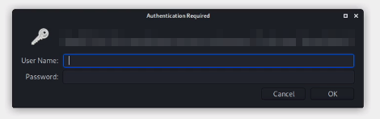

# Login bypass with POST

**Context:**

> If an application uses GET to show prompt() login to the access page, try to use POST to get access to the final page.

**Context Page:**

<figure><figcaption><p>Context Example</p></figcaption></figure>

**Bypass:**

```bash
curl -X POST url > index.html
```

**Note:**

> The CURL used POST to get the final page and is saved on index.html
